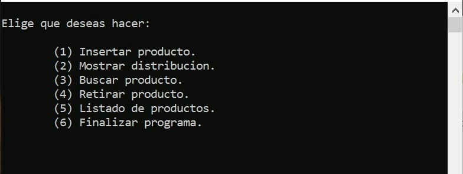
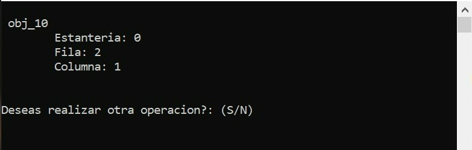
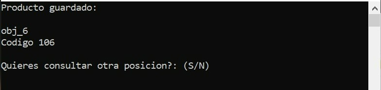
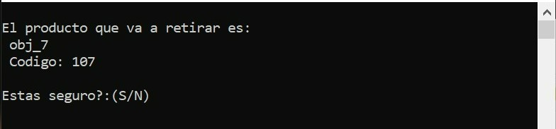

# Simulador-simple-stock-almacén
Programa sencillo cuyo funcionamiento se basa en la introducción o retirada de productos en las estanterías de un almacén.

### Inicio

### (1) Insertar producto

### (2) Mostrar distribución

### (3) Buscar producto

- 3.1. Buscar por código
  

- 3.2. Buscar por nombre
  

- 3.3. Buscar por posición
  

### (4) Retirar producto

- 4.1. Confirmación
  

### (5) Listar productos
